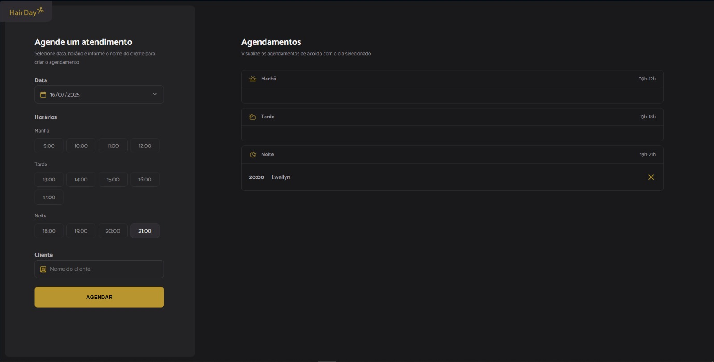

# Hair Day | Plataforma de Agendamento de Cabeleireiro

## 📋 Sobre o Projeto
Este projeto é uma plataforma de agendamento de cabeleireiro, desenvolvida com HTML, CSS e JavaScript, que permite aos usuários marcar horários para diferentes serviços de cabeleireiro. A interface do usuário foi projetada para ser intuitiva e fácil de usar, proporcionando uma experiência de usuário fluida e eficiente.

A plataforma inclui funcionalidades como seleção de serviços, escolha de horários disponíveis, preenchimento de informações de contato, e confirmação de agendamento. Cada seção da plataforma é claramente delineada, garantindo uma experiência de usuário suave e sem complicações.

## 💻 Tecnologias Utilizadas

- HTML5
- CSS3
- Javascript