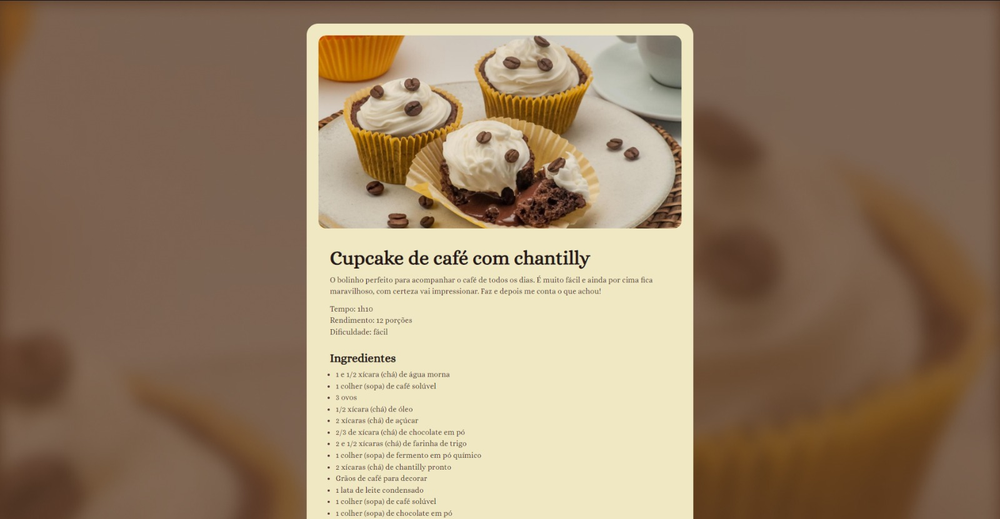

# Página de receitas

## 📋 Sobre o Projeto
Este projeto tem como objetivo criar um site que apresente uma receita de forma atraente e fácil de entender. Utilizando HTML e CSS responsivo, a página oferece uma visão clara das etapas necessárias para preparar a receita, garantindo uma experiência agradável aos usuários.