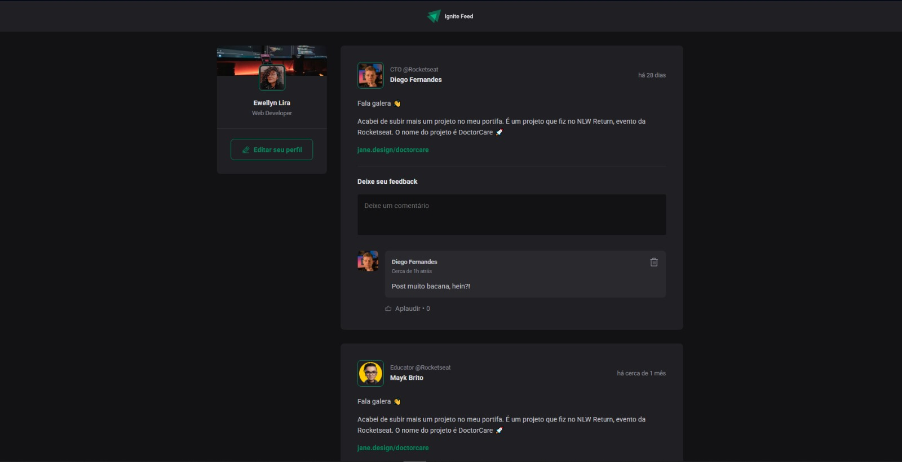

# 💬 Ignite Feed

## 📋 Sobre o Projeto

O **Ignite Feed** é uma aplicação que simula um feed de rede social, permitindo visualizar publicações, interagir com comentários e gerenciar feedbacks de forma simples e intuitiva.  
O projeto foi desenvolvido com foco em **componentização**, **boas práticas de React** e **experiência do usuário**, seguindo o padrão visual moderno proposto pela Rocketseat.

A interface apresenta posts de usuários, área de comentários e ações de interação, tudo organizado em um layout limpo, responsivo e de fácil navegação.

## 🚀 Funcionalidades

- Exibição de posts no feed  
- Área para comentários nos posts  
- Interações básicas (curtidas/aplausos/exclusão de comentários)  
- Layout responsivo  
- Estrutura baseada em componentes reutilizáveis 