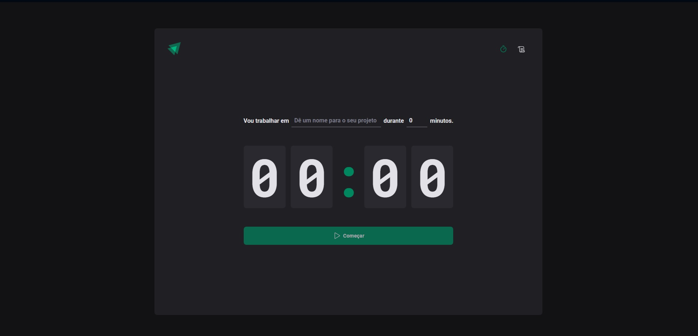

# ⏱️ Ignite Timer  

## 📋 Sobre o Projeto  

O **Ignite Timer** é uma aplicação focada em **gestão de tempo e produtividade**, permitindo que o usuário crie ciclos de trabalho personalizados e acompanhe o tempo de forma visual e intuitiva.  

O projeto foi desenvolvido com foco em **componentização**, **boas práticas com React**, **gerenciamento de estado** e **experiência do usuário**, seguindo um padrão visual moderno e minimalista.

A interface permite definir um nome para o projeto, escolher a duração do ciclo em minutos e iniciar a contagem regressiva em tempo real, promovendo mais organização e foco durante as tarefas.

---

## 🚀 Funcionalidades  

- Definição de nome para o ciclo/projeto  
- Configuração do tempo em minutos  
- Contagem regressiva em tempo real  
- Botão para iniciar e interromper o ciclo  
- Histórico de ciclos realizados (se implementado)  
- Layout moderno, minimalista e responsivo  
- Estrutura baseada em componentes reutilizáveis  