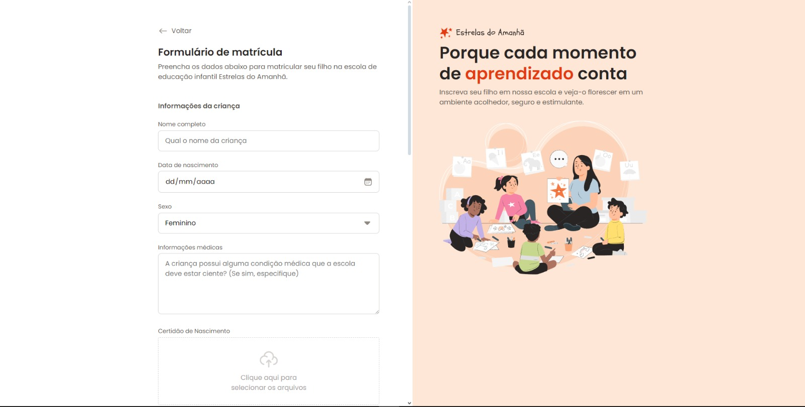

# Formulário de matricula

## 🚀 Visão Geral

Formulário de matrícula desenvolvido com HTML e CSS Grid, oferecendo uma experiência moderna e intuitiva. Inclui diversos tipos de inputs, como texto, checkbox, radio buttons, dropdowns e campos de upload, tudo de forma organizada e eficiente.

## 📋 Sobre o Projeto

Este projeto é um formulário de matrícula desenvolvido com HTML e CSS utilizando a técnica de Grid, oferecendo uma experiência de preenchimento moderna e intuitiva. O formulário permite que os usuários insiram informações de forma organizada e visualmente atraente, proporcionando uma navegação fácil e eficiente.

O formulário inclui diversos tipos de inputs, como campos de texto para nome e endereço, caixas de seleção (checkbox) para cursos de interesse, botões de opção (radio buttons) para seleção de turno, menus suspensos (dropdown) para escolha de turma, e campos de upload para anexar documentos necessários. Cada seção do formulário é claramente delineada, garantindo uma experiência de usuário suave e sem complicações.

## 💻 Tecnologias Utilizadas

- HTML5
- CSS3