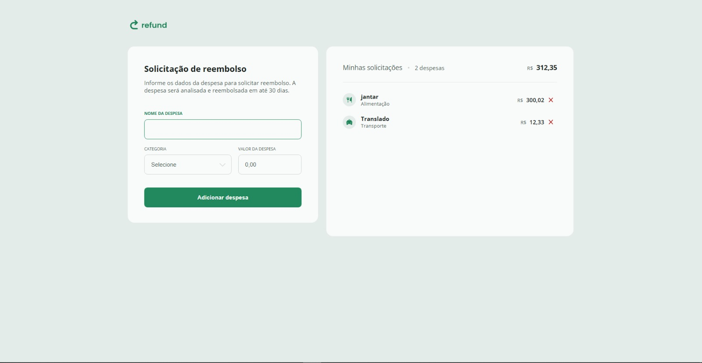

# Refund | Plataforma de Cadastro de Reembolsos

## 📋 Sobre o Projeto
Este projeto é uma plataforma de cadastro de reembolsos, desenvolvida com HTML, CSS e JavaScript, que permite aos usuários registrar os gastos que necessitam ser reembolsados. A interface do usuário foi projetada para ser intuitiva e fácil de usar, proporcionando uma experiência de usuário fluida e eficiente.

A plataforma inclui funcionalidades como:

- Preenchimento de formulários com campos para valor, nome e tipo de gasto
- Organização dos registros de forma clara e acessível
- Facilidade no processo de solicitação de reembolso para os funcionários

## 💻 Tecnologias Utilizadas

- HTML5
- CSS3