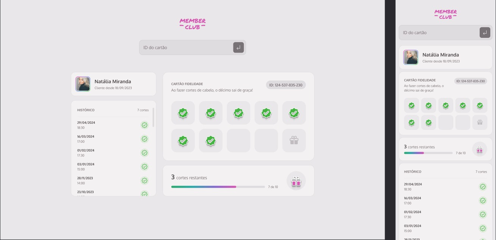

# Members Club | Plataforma de um Cartão fidelidade

## 📋 Sobre o Projeto

Este projeto é uma plataforma de fidelização para clientes, desenvolvida com HTML, CSS e JavaScript, que permite aos usuários consultarem o histórico de seus cortes e o progresso de selos completados para atingir a marca e ganhar o corte grátis. A interface do usuário foi projetada para ser intuitiva e fácil de usar, proporcionando uma experiência de usuário fluida e eficiente.

## 💻 Tecnologias Utilizadas

- HTML5
- CSS3
- JavaScript
- JSON Server

